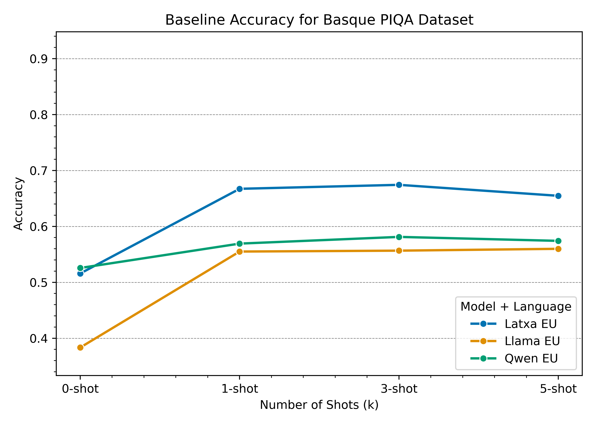
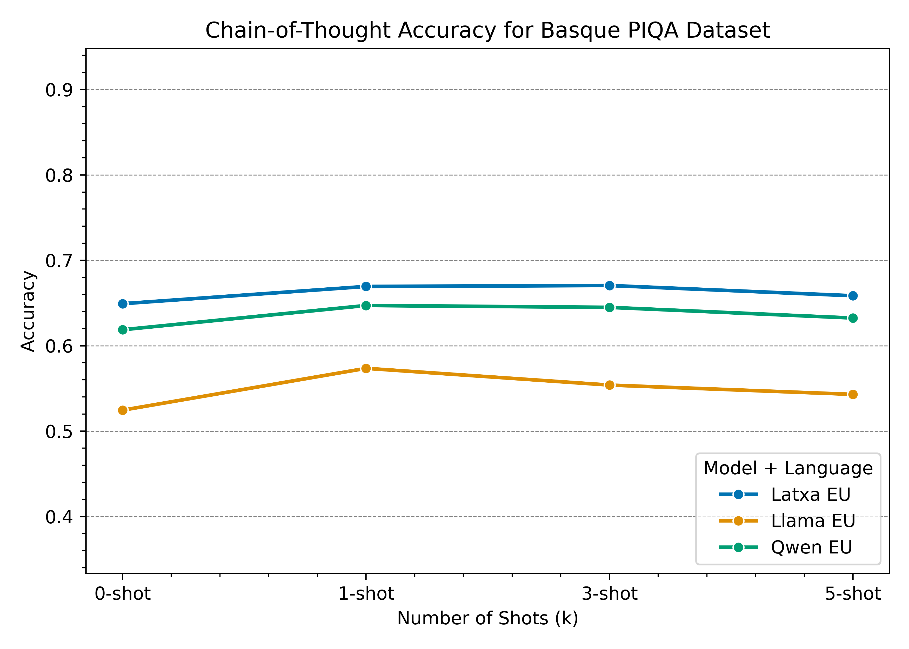

# Evaluating Commonsense Reasoning in Basque and English

A comparative study of commonsense reasoning performance in English and Basque using LLaMA 3.1, Qwen3, and Latxa (an instruction-tuned Basque model based on LLaMA 3.1) on the PIQA benchmark.

---

## Overview

This project investigates how language and fine-tuning for a low-resource language affect the commonsense reasoning capabilities of large language models. The evaluation is performed using the PIQA dataset translated into Basque and its original English version. The models tested include:

* **LLaMA 3.1 8B**: A strong general-purpose LLM.
* **Qwen3 4B**: A multimodal-capable model evaluated in multiple prompting modes and native reasoning.
* **Latxa 3.1 8B**: A Basque-tuned instruction-following model built on LLaMA 3.1.

The evaluation includes few-shot and chain-of-thought (CoT) prompting across both languages.

---

## Repository Structure

```
latxa_PIQA/
├── cot_evaluation.py          # Chain-of-thought evaluation driver (--model, --lang)
├── few_shot_evaluation.py     # Few-shot evaluation driver (--model, --lang)
├── qwen_evaluation.py         # Qwen3 evaluation driver (--lang)
├── plot_k_shot.py             # Script to plot k-shot accuracy
├── plot_malformed.py          # Script to plot malformed experiment results
├── images/                    # Generated plots
├── preliminar_work/           # Preliminary scripts and tests
│   ├── download_piqa.py
│   ├── fix-train.py
│   └── preliminar_tests.py
├── prompts.txt                # Various prompt templates
└── results/                   # Raw and summarized evaluation outputs
    ├── cot-results/           # Chain-of-thought JSONL results and bad-case logs
    ├── k-shot-results/        # Few-shot JSONL results
    ├── qwen-results/          # Qwen3 results and summaries
    └── results_summary.txt    # Tabulated summary of all experiments
```

---

## Models

| Model                       | Description                                            | Source                       |
| --------------------------- | ------------------------------------------------------ | ---------------------------- |
| Meta-Llama-3.1-8B-Instruct  | Base English instructed LLaMA model                    | Meta AI (2024)               |
| Qwen/Qwen3-4B               | Multimodal-capable large language model                | Qwen Technical Report (2025) |
| Latxa-Llama-3.1-8B-Instruct | Basque-fine-tuned instruction model based on LLaMA 3.1 | Etxaniz et al. (2024)        |

Place model checkpoints under `model_cache/` or configure your environment to cache from Hugging Face.

---

## Usage

### few\_shot\_evaluation.py

Evaluate k-shot PIQA with Latxa 3.1 or LLaMA 3.1:

```bash
python3 few_shot_evaluation.py --model <latxa|llama> --lang <en|eu>
```

* `--model`: `latxa` for Latxa-Llama-3.1-8B-Instruct, `llama` for Meta-Llama-3.1-8B-Instruct.
* `--lang`: `en` for English, `eu` for Basque.

### cot\_evaluation.py

Evaluate chain-of-thought prompting with Latxa or Meta-LLaMA:

```bash
python3 cot_evaluation.py --model <latxa|llama> --lang <en|eu>
```

Same arguments as above.

### qwen\_evaluation.py

Evaluate Qwen3 with or without reasoning:

```bash
python3 qwen_evaluation.py --lang <en|eu|eu_enreas>
```
* `--lang`: `en` for English, `eu` for Basque. `eu_enreas` for Basque questions with English reasoning continuation.


### Plotting Scripts

* `plot_k_shot.py`: Generates accuracy plots.
* `plot_malformed.py`: Generates plots for the malformed instance counts.

Output goes to `images/`.

---

## Results



Key findings:

* Latxa significantly outperforms LLaMA 3.1 and Qwen3 on PIQA-eu.
* Chain-of-thought prompting improves zero-shot performance in both languages.
* All models perform better on English PIQA than Basque.
* Latxa shows a drop on English PIQA but strong gains on Basque when comparing with it's LLaMa counterpart, validating its specialization.


All the plots are available in the `images/` directory and evaluation summaries in `results/results_summary.txt`.

---
